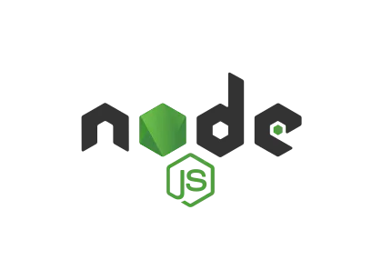
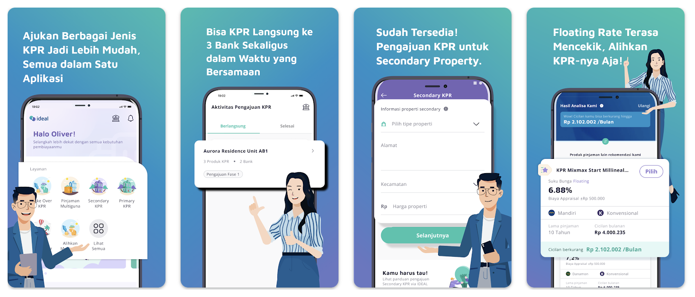
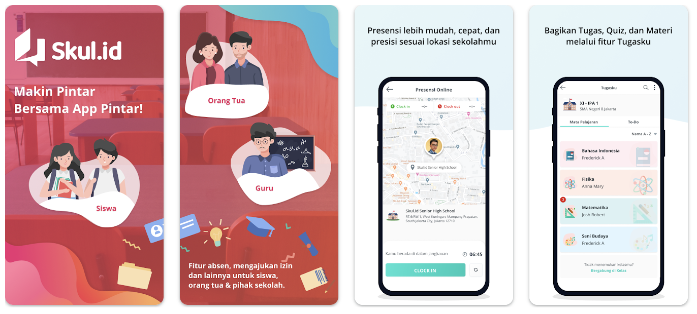
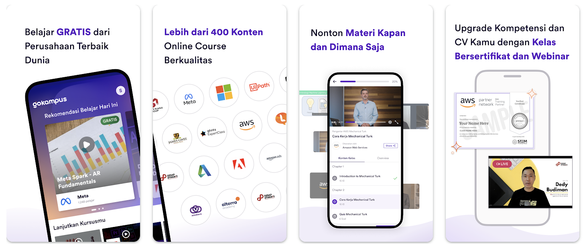
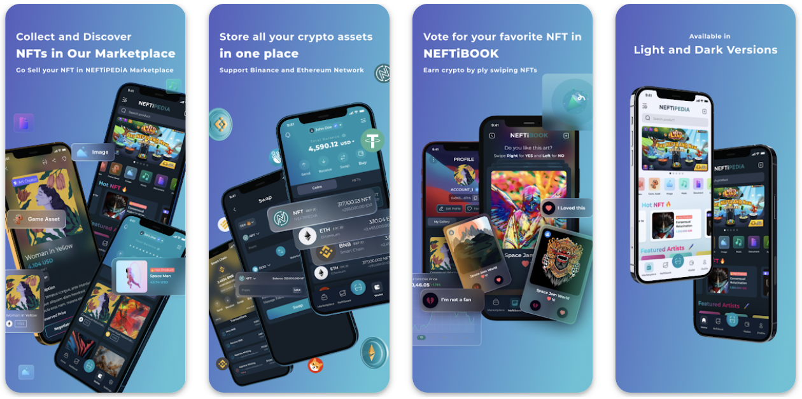
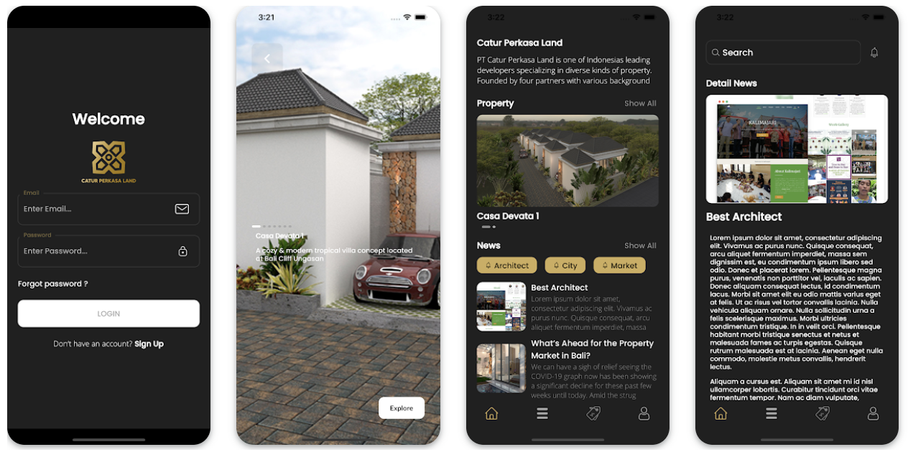
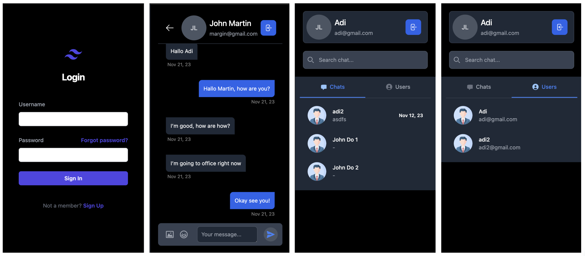

# I Putu Adi Sanjaya

Hello I’m Adi, highly skilled and dedicated mobile application developer aspecially in Flutter with 4 years of experience, with a passion for creating innovative, user-friendly applications and high performance application. Committed to delivering high-quality solutions that exceed client expectations. Seeking challenging projects to utilize my expertise in Software Engineer and contribute to the success of a dynamic organization.

Other than that i am open to learn any new technology to fit this role, i am a fast learner and practical person, so i can adapt fast to help the team to achieve the goals.

&nbsp;&nbsp;&nbsp;

<h2 align="left" id="macropower-tech">Skills</h2>

> Tools, languages, and other things that I like to work with.

<table>
  <tr>
    <td align="center" width="96">
      
       Flutter
    </td>
    <td align="center" width="96">
        
       Firebase
    </td>
    <td align="center" width="96">
      
       Javascript
    </td>
    <td align="center" width="96">
      
       Typescript
    </td>
    <td align="center" width="96">
      
       Node.JS
    </td>
    <td align="center" width="96">
      
       Express.JS
    </td>
    <td align="center" width="96">
      
       Next.JS
    </td>
    <td align="center" width="96">
      
       Nest.JS
    </td>
    <td align="center" width="96">
      
       Strapi
    </td>
    <td align="center" width="96">
        
        React Native
    </td>
    <td align="center" width="96">
      
       Git
    </td>
    <td align="center" width="96">
      
       Android Studio
    </td>
    <td align="center" width="96">
      
       XCode
    </td>
    <td align="center" width="96">
      
       Playstore
    </td>
    <td align="center" width="96">
      
       App Store
    </td>
  </tr>
</table>

# Education

> Institut Teknologi dan Bisnis STIKOM Bali  
> (S1, Sistem Informasi)  
> 2019 - 2022

> SMK TI Bali Global Denpasar  
> (Software Engineer)  
> 2017 - 2019

# Certifications

> Full Stack Development  
> Binar Academy  
> Jan 2023  

> Software Development  
> Lembaga Sertifikasi Profesi Informatika  
> Oct 2021  

> Web Development  
> Kementrian Perindustrian Republik Indonesia  
> May 2019  

> Certificate in Supply Chain Associate  
> Logical Operations  
> Feb 2022  

> Microsoft Office Desktop Training  
> Trust Training Partners  
> Oct 2021  

# Portfolio

---

# Ideal

> Tech Stack : Flutter, Firebase, Next.JS, Javascript, Typescript

<table>
  <tr>
    &nbsp;&nbsp;&nbsp;
  </tr>
  <tr>
    
  </tr>
</table>

---

# Skul.ID

> Tech Stack : Flutter, Firebase, Next.JS, Javascript, Typescript

<table>
  <tr>
    &nbsp;&nbsp;&nbsp;
  </tr>
  <tr>
    
  </tr>
</table>

## 

# Go Kampus

> Tech Stack : Flutter, Firebase, Next.JS, Javascript, Typescript

<table>
  <tr>
    &nbsp;&nbsp;&nbsp;
  </tr>
  <tr>
    
  </tr>
</table>

---

# NEFTiPEDiA

> Tech Stack : Flutter, Firebase, Next.JS, Strapi, Express.JS, Node.JS, Javascript, Typescript

<table>
  <tr>
    &nbsp;&nbsp;&nbsp;
  </tr>
  <tr>
    
  </tr>
</table>

---

# Catur Perkasa Land: Warriors

> Tech Stack : Flutter, Firebase, Javascript, Typescript

<table>
  <tr>
    &nbsp;&nbsp;&nbsp;
  </tr>
</table>

---

# Chat App

> Tech Stack : Next.JS, Firebase, Javascript, Typescript, Express.JS, PostgreSQL, Node.JS

---

## Thanks for stopping by!
